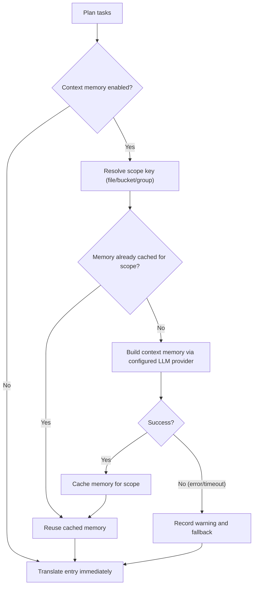

## Usage

```bash
hyperlocalise run [--config <path>] [--group <name>] [--bucket <name>] [--target-locale <locale>] [--dry-run] [--workers <count>] [--output <report.json>] [--experimental-context-memory] [--context-memory-scope <file|bucket|group>] [--context-memory-max-chars <count>]
```

## Behavior

1. load and validate config,
2. plan tasks from groups and buckets,
3. skip tasks already in `.hyperlocalise.lock.json`,
4. execute remaining tasks,
5. persist successful tasks to lock state.

For lockfile fields, lifecycle, and reset guidance, see [Lockfile contract](/reference/lockfile-contract).

## Supported local file formats

`run` can read source and target files with these extensions:

- `.json`
- `.arb`
- `.xlf` and `.xliff`
- `.po`
- `.md`
- `.mdx`
- `.strings`
- `.csv`

For JSON (`.json`), `run` supports:

- standard nested key/value JSON objects
- FormatJS message JSON when the root strictly matches:
  `{"[id]": {"defaultMessage": "[message]", "description": "[description]"}}`

In FormatJS mode, only `defaultMessage` is translated. Keys (message IDs), `description`, and other non-message metadata are preserved.

For Flutter ARB (`.arb`), `run` translates only message keys and preserves metadata keys such as `@key` and `@@locale` unchanged.

For Markdown and MDX (`.md`, `.mdx`), `run` translates extracted prose and preserves non-translatable structure:

- frontmatter blocks (`---`)
- fenced code blocks (```` ``` ```` and `~~~`)
- inline code spans
- Markdown anchors such as link destinations
- MDX `import` and `export` lines
- JSX/MDX component tags and attribute values

For Apple/Xcode Strings (`.strings`), `run` preserves comments and key/value formatting from the template while replacing value literals with translated text.


For CSV (`.csv`), `run` supports two layouts:

- key/value layout (for example: `key,value`)
- per-locale column layout (for example: `id,en,fr,de`)

When writing CSV targets, `run` preserves the existing header and non-target columns, updates matching keys in place, and appends new keys in deterministic sorted order.

## Flags

- `--config`: path to config file (default `i18n.jsonc` in current directory)
- `--group`: run only tasks for the given group name
- `--bucket`: run only tasks for the given bucket name
- `--target-locale`: run only tasks for the given target locale (repeatable)
- `--dry-run`: print plan only, do not translate or write files
- `--force`: rerun all planned tasks and ignore lockfile skip state
- `--prune`: remove target keys that no longer exist in source files
- `--prune-max-deletions`: maximum stale keys deleted in one run before requiring an explicit override (default `100`)
- `--prune-force`: bypass the prune deletion safety limit
- `--workers`: number of parallel translation workers (defaults to CPU cores)
- `--progress`: progress rendering mode (`auto|on|off`, default: `auto`)
- `--output`: write machine-readable JSON run report to the given path
- `--experimental-context-memory`: enable two-stage context memory generation before translating each scope
- `--context-memory-scope`: context sharing scope (`file|bucket|group`, default `file`)
- `--context-memory-max-chars`: maximum context memory length injected into each translation request (default `1200`)

### Progress debug logging (optional)

To troubleshoot progress rendering, you can enable debug logs without changing CLI flags:

- `HYPERLOCALISE_PROGRESS_DEBUG=1` enables progress debug logging.
- `HYPERLOCALISE_PROGRESS_DEBUG_FILE=<path>` overrides log file location.

Default log path when enabled: `.hyperlocalise/logs/run.log`.

## Experimental context memory flow

When `--experimental-context-memory` is enabled, `run` builds shared memory once per scope (default: per source file), then reuses it for all entries in that scope.

If memory generation fails or times out, `run` logs a warning and continues translation without shared memory for that scope.



### Why it can appear to wait

- First entry in a new scope waits for memory generation to finish.
- Later entries in the same scope reuse cached memory and proceed without rebuilding.
- Progress UI now shows context-memory steps in the file list so you can see active scope-level work.


## Scope runs to one group

Use `--group` when you want to run only one configured group.

```bash
hyperlocalise run --group tests --dry-run
```

If the group does not exist in your config, `run` fails with an `unknown group` planning error.

## Scope runs to one bucket

Use `--bucket` when you want to run only one configured bucket. This is useful for focused updates, CI partitioning, or validating a single area before a full run.

```bash
hyperlocalise run --bucket ui --dry-run
```

If the bucket does not exist in your config, `run` fails with an `unknown bucket` planning error.

## Scope runs to one target locale

Use `--target-locale` when you want to re-run only specific locales without changing group or bucket selection. You can repeat the flag to select multiple locales.

```bash
hyperlocalise run --group tests --target-locale fr --target-locale de --dry-run
```

If a requested locale is not present in `locales.targets`, `run` fails with an `unknown target locale` planning error. When combined with `--group`, only locales that belong to that group are planned.

When combined with `--prune`, stale-key detection is also limited to the selected target locales. `run` only scans and prunes target files that belong to the filtered locale set.

```bash
hyperlocalise run --prune --target-locale de --dry-run
```

## Force rerun all planned tasks

Use `--force` to ignore lockfile skip state and execute every planned task again.

```bash
hyperlocalise run --group tests --force
```

## Output fields

- `planned_total`
- `skipped_by_lock`
- `executable_total`
- `succeeded`
- `failed`
- `persisted_to_lock`
- `prompt_tokens`
- `completion_tokens`
- `total_tokens`

Per-locale token usage is printed as: `locale_usage locale=<locale> prompt_tokens=<...> completion_tokens=<...> total_tokens=<...>`.

When you pass `--output`, the JSON report includes run metadata (`generatedAt`, `configPath`), aggregate token usage, per-locale usage, and per-entry batch usage.

## Failure output

On task failure, output includes `failure target=<...> key=<...> reason=<...>`.


## Worker tuning guidance

Lower `--workers` when you hit provider rate limits or run in constrained CI environments. Start with `1` to stabilize retries and then increase gradually.

Raise `--workers` when your provider quota and machine resources allow more throughput. Increase in small steps and watch API error rates plus local CPU and memory usage.

## See also

- [eval](/commands/eval)
- [status](/commands/status)
- [sync push](/commands/sync-push)
- [sync pull](/commands/sync-pull)
- [Lockfile contract](/reference/lockfile-contract)
