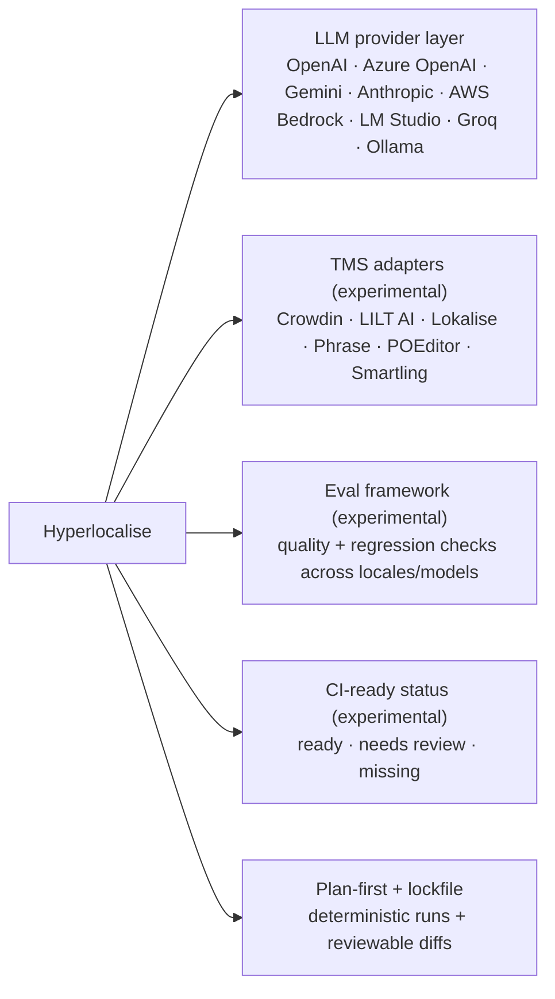

`hyperlocalise` helps you generate local translation drafts, optionally sync with your TMS, and track what still needs review.

## Who this is for

Use this CLI if you:

- keep translation files in your repository,
- want AI-generated drafts as a starting point,
- want to choose between zero-human workflows and optional human curation in Crowdin, LILT AI, Lokalise, Phrase, POEditor, or Smartling.

## What Hyperlocalise focuses on

Status mapping to command output:

- `ready` = `translated`
- `needs review` = `needs_review`
- `missing` = `untranslated`

## Core workflow

| Stage | Action | Why it matters |
| --- | --- | --- |
| 1 | [`init`](/commands/init) | Scaffold `i18n.jsonc` and bootstrap defaults. |
| 2 | Configure [`i18n config`](/configuration/i18n-config) | Define locales, buckets, and LLM/storage settings. |
| 3 | [`run --dry-run`](/commands/run) | Validate plan and detect issues before writing drafts. |
| 4 | [`run`](/commands/run) | Generate local draft translations. |
| 5 | [Release from local repo](/commands/run) | Zero-human path when your process allows direct publish from generated outputs. |
| 6 (optional) | [`sync push` (experimental)](/commands/sync-push) | Upload local changes to your TMS for curation workflows. |
| 7 (optional) | Curate in TMS | Human review and correction in your translation platform. |
| 8 (optional) | [`sync pull` (experimental)](/commands/sync-pull) | Bring curated translations back into the repository. |
| 9 | [`status`](/commands/status) | Measure completion and unresolved work in either workflow path. |

## Start in 10 minutes

1. [Installation](/getting-started/install).
2. [Run quickstart](/getting-started/quickstart).
3. [Set up your i18n config](/configuration/i18n-config).

## Common next steps

- Learn command behavior in [commands overview](/commands/overview).
- Configure provider credentials in [provider credentials](/configuration/provider-credentials).
- Understand sync behavior in [storage overview](/storage/overview).
- Choose an operating model in [workflow decision guide](/workflows/workflow-decision-guide).
- Check feature maturity in [stability matrix](/reference/stability-matrix).
