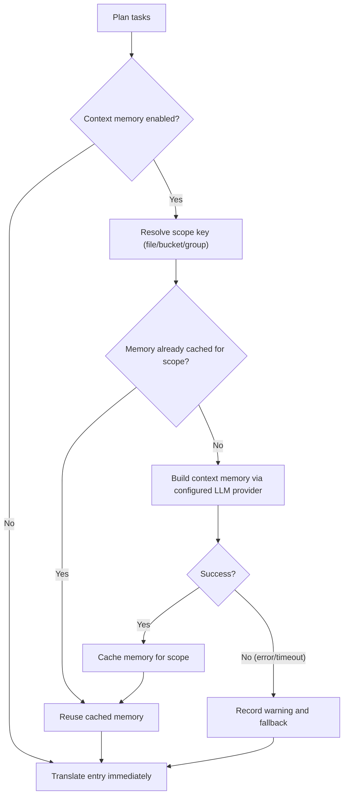

## Sử dụng

```bash
hyperlocalise run [--config <path>] [--group <name>] [--bucket <name>] [--dry-run] [--workers <count>] [--output <report.json>] [--experimental-context-memory] [--context-memory-scope <file|bucket|group>] [--context-memory-max-chars <count>]
```

## Hành vi

1. tải và xác thực cấu hình,
2. lập kế hoạch tác vụ từ nhóm và bộ chứa,
3. bỏ qua các tác vụ đã có trong `.hyperlocalise.lock.json`,
4. thực hiện các tác vụ còn lại,
5. lưu các tác vụ thành công vào trạng thái khóa.

Để biết các trường lockfile, vòng đời và hướng dẫn đặt lại, xem [Hợp đồng lockfile](/reference/lockfile-contract).

## Các định dạng tệp cục bộ được hỗ trợ

`run` có thể đọc các tệp nguồn và tệp đích với các phần mở rộng sau:

- `.json`
- `.arb`
- `.xlf` và `.xliff`
- `.po`
- `.md`
- `.mdx`
- `.strings`
- `.csv`

Đối với JSON (`.json`), `run` hỗ trợ:

- các đối tượng JSON lồng nhau tiêu chuẩn với cặp khóa/giá trị
- Định dạng JSON thông điệp FormatJS khi phần gốc khớp chính xác:
  `{"[id]": {"defaultMessage": "[message]", "description": "[description]"}}`

Ở chế độ FormatJS, chỉ `defaultMessage` được dịch. Khóa (ID tin nhắn), `description`, và các nội dung không khác-siêu dữ liệu của thông điệp được giữ nguyên.

Dành cho Flutter ARB (`.arb`), `run` chỉ dịch các khóa thông điệp và giữ nguyên các khóa siêu dữ liệu như `@key` và `@@locale` không thay đổi.

Dành cho Markdown và MDX (`.md`, `.mdx`), `run` dịch văn bản được trích xuất và giữ nguyên nội dung không-cấu trúc có thể dịch:

- khối frontmatter (`---`)
- khối mã được rào lại (```` ``` ```` and `~~~`)
- các đoạn mã nội tuyến
- Neo Markdown như đích liên kết
- MDX `import` và `export` dòng
- Thẻ thành phần JSX/MDX và giá trị thuộc tính

Dành cho chuỗi Apple/Xcode (`.strings`), `run` giữ nguyên các bình luận và định dạng khóa/giá trị từ mẫu trong khi thay thế các giá trị literal bằng văn bản đã dịch.


Đối với CSV (`.csv`), `run` hỗ trợ hai bố cục:

- Bố cục khóa/giá trị (ví dụ: `key,value`)
- mỗi-bố cục cột ngôn ngữ (ví dụ: `id,en,fr,de`)

Khi viết các mục tiêu CSV, `run` giữ nguyên tiêu đề hiện có và không-các cột đích, cập nhật các khóa khớp ngay tại chỗ và thêm các khóa mới theo thứ tự sắp xếp xác định.

## Cờ

- `--config`: đường dẫn đến tệp cấu hình (mặc định `i18n.jsonc` trong thư mục hiện tại)
- `--group`: chỉ chạy các tác vụ cho tên nhóm đã cho
- `--bucket`: chỉ chạy các tác vụ cho tên bucket đã chỉ định
- `--dry-run`: chỉ in kế hoạch, không dịch hoặc ghi tệp
- `--force`: chạy lại tất cả các tác vụ đã lên kế hoạch và bỏ qua trạng thái bỏ qua của tệp khóa
- `--workers`: số lượng worker dịch song song (mặc định theo số lõi CPU)
- `--progress`: chế độ kết xuất tiến trình (`auto|on|off`, mặc định: `auto`)
- `--output`: máy ghi-Báo cáo chạy JSON dễ đọc vào đường dẫn đã cho
- `--experimental-context-memory`: bật hai-Tạo bộ nhớ ngữ cảnh theo từng giai đoạn trước khi dịch từng phạm vi
- `--context-memory-scope`: phạm vi chia sẻ ngữ cảnh (`file|bucket|group`, mặc định `file`)
- `--context-memory-max-chars`: độ dài bộ nhớ ngữ cảnh tối đa được chèn vào mỗi yêu cầu dịch (mặc định `1200`)

### Ghi nhật ký gỡ lỗi tiến trình (tùy chọn)

Để khắc phục sự cố hiển thị tiến trình, bạn có thể bật nhật ký gỡ lỗi mà không cần thay đổi các cờ CLI:

- `HYPERLOCALISE_PROGRESS_DEBUG=1` bật ghi nhật ký gỡ lỗi tiến độ.
- `HYPERLOCALISE_PROGRESS_DEBUG_FILE=<path>` ghi đè vị trí tệp nhật ký.

Đường dẫn nhật ký mặc định khi được bật: `.hyperlocalise/logs/run.log`.

## Luồng bộ nhớ ngữ cảnh thử nghiệm

Khi `--experimental-context-memory` đã được bật, `run` tạo bộ nhớ dùng chung một lần cho mỗi phạm vi (mặc định: theo từng tệp nguồn), sau đó tái sử dụng nó cho tất cả các mục trong phạm vi đó.

Nếu việc tạo bộ nhớ thất bại hoặc hết thời gian chờ, `run` ghi nhật ký cảnh báo và tiếp tục dịch mà không có bộ nhớ chia sẻ cho phạm vi đó.



### Vì sao có thể trông như đang chờ

- Mục nhập đầu tiên trong một phạm vi mới sẽ chờ quá trình tạo bộ nhớ hoàn tất.
- Các mục sau trong cùng phạm vi sẽ tái sử dụng bộ nhớ đã lưu trong bộ nhớ đệm và tiếp tục mà không cần xây dựng lại.
- Giao diện tiến trình hiện hiển thị ngữ cảnh-lưu các bước trong danh sách tệp để bạn có thể xem phạm vi đang hoạt động-công việc cấp độ.


## Phạm vi chỉ áp dụng cho một nhóm

Sử dụng `--group` khi bạn muốn chỉ chạy một nhóm đã được cấu hình.

```bash
hyperlocalise run --config i18n.jsonc --group tests --dry-run
```

Nếu nhóm không tồn tại trong cấu hình của bạn, `run` bị lỗi với một `unknown group` lỗi lập kế hoạch.

## Phạm vi chạy tới một bucket

Sử dụng `--bucket` khi bạn chỉ muốn chạy một bucket đã được cấu hình. Điều này hữu ích cho việc cập nhật có trọng tâm, phân vùng CI, hoặc xác thực một khu vực riêng lẻ trước khi chạy toàn bộ.

```bash
hyperlocalise run --config i18n.jsonc --bucket ui --dry-run
```

Nếu bucket không tồn tại trong cấu hình của bạn, `run` thất bại với một `unknown bucket` lỗi lập kế hoạch.

## Buộc chạy lại tất cả các tác vụ đã lên kế hoạch

Sử dụng `--force` để bỏ qua trạng thái bỏ qua trong lockfile và thực thi lại mọi tác vụ đã lên kế hoạch.

```bash
hyperlocalise run --config i18n.jsonc --group tests --force
```

## Các trường đầu ra

- `planned_total`
- `skipped_by_lock`
- `executable_total`
- `succeeded`
- `failed`
- `persisted_to_lock`
- `prompt_tokens`
- `completion_tokens`
- `total_tokens`

Per-mức sử dụng token theo ngôn ngữ được in như sau: `locale_usage locale=<locale> prompt_tokens=<...> completion_tokens=<...> total_tokens=<...>`.

Khi bạn chuyển qua `--output`, báo cáo JSON bao gồm siêu dữ liệu chạy (`generatedAt`, `configPath`), tổng mức sử dụng token, theo-cách sử dụng ngôn ngữ, và theo-cách sử dụng lô nhập liệu.

## Đầu ra lỗi

Khi tác vụ thất bại, đầu ra bao gồm `failure target=<...> key=<...> reason=<...>`.


## Hướng dẫn tinh chỉnh worker

Thấp `--workers` khi bạn gặp giới hạn tốc độ của nhà cung cấp hoặc chạy trong các môi trường CI bị hạn chế. Bắt đầu với `1` để ổn định các lần thử lại rồi tăng dần.

Tăng `--workers` khi hạn mức của nhà cung cấp và tài nguyên máy của bạn cho phép tăng thông lượng. Tăng theo từng bước nhỏ và theo dõi tỷ lệ lỗi API cùng với mức sử dụng CPU và bộ nhớ cục bộ.

## Xem thêm

- [eval](/commands/eval)
- [trạng thái](/commands/status)
- [đồng bộ đẩy](/commands/sync-push)
- [đồng bộ kéo xuống](/commands/sync-pull)
- [Hợp đồng tệp khóa](/reference/lockfile-contract)
