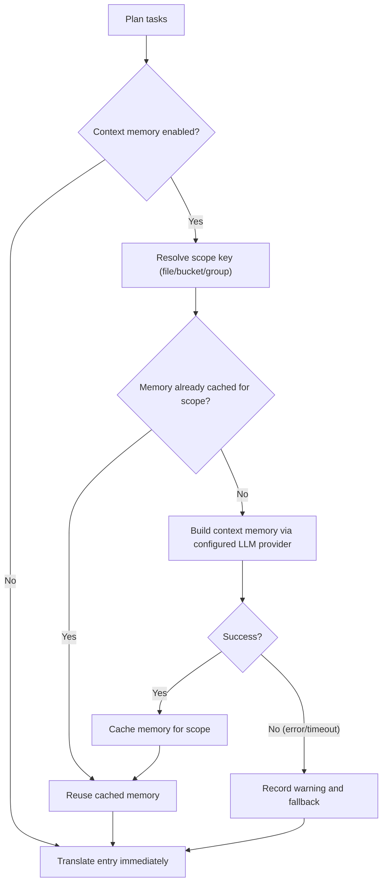

## Cách sử dụng

```bash
hyperlocalise run [--config <path>] [--group <name>] [--bucket <name>] [--target-locale <locale>] [--dry-run] [--workers <count>] [--output <report.json>] [--experimental-context-memory] [--context-memory-scope <file|bucket|group>] [--context-memory-max-chars <count>]
```

## Hành vi

1. Tải và xác thực cấu hình
2. lập kế hoạch cho các nhiệm vụ từ các nhóm và thư mục
3. skip tasks already in `.hyperlocalise.lock.json`,
4. hoàn thành các nhiệm vụ còn lại
5. Lưu trữ các tác vụ thành công để ghi trạng thái.

For lockfile fields, lifecycle, and reset guidance, see [Lockfile contract](/reference/lockfile-contract).

## Các định dạng tệp cục bộ được hỗ trợ

`run` can read source and target files with these extensions:

- `.json`
- `.arb`
- `.xlf` and `.xliff`
- `.po`
- `.md`
- `.mdx`
- `.strings`
- `.csv`

For JSON (`.json`), `run` supports:

- đối tượng JSON có cấu trúc nhúng tiêu chuẩn
- Định dạng JSON message FormatJS khi phần gốc khớp chính xác:
  `{"[id]": {"defaultMessage": "[message]", "description": "[description]"}}`

In FormatJS mode, only `defaultMessage` is translated. Keys (message IDs), `description`, and other non-message metadata are preserved.

For Flutter ARB (`.arb`), `run` translates only message keys, preserves metadata keys such as `@key`, and normalizes `@@locale` to the target locale on write.

For Markdown and MDX (`.md`, `.mdx`), `run` translates extracted prose and preserves non-translatable structure:

- các khối frontmatter (`---`)
- khu vực mã (```` ``` ```` và `~~~`)
- dấu ngoặc, đoạn mã
- Liên kết Markdown như đích đến
- MDX `import` and `export` lines
- Nhãn và giá trị thuộc tính của các thành phần JSX/MDX

Đối với chuỗi của Apple/Xcode (`.strings`), `run`, vẫn giữ lại các chú thích và định dạng khóa/giá trị từ mẫu, đồng thời thay thế các giá trị theo văn bản đã dịch.


Đối với CSV (`.csv`), `run` hỗ trợ hai bố cục:

- Cấu trúc key/value (ví dụ: `key,value`)
- per-locale column layout (for example: `id,en,fr,de`)

When writing CSV targets, `run` preserves the existing header and non-target columns, updates matching keys in place, and appends new keys in deterministic sorted order.

## Cờ

- `--config`: path to config file (default `i18n.jsonc` in current directory)
- `--group`: Chỉ chạy các tác vụ cho nhóm được chỉ định
- `--bucket`: run only tasks for the given bucket name
- `--target-locale`: run only tasks for the given target locale (repeatable)
- `--dry-run`: print plan only, do not translate or write files
- `--force`: rerun all planned tasks and ignore lockfile skip state
- `--prune`: remove target keys that no longer exist in source files
- `--prune-max-deletions`: maximum stale keys deleted in one run before requiring an explicit override (default `100`)
- `--prune-force`: bỏ qua giới hạn an toàn xóa
- `--workers`: number of parallel translation workers (defaults to CPU cores)
- `--progress`: chế độ hiển thị tiến trình (`auto|on|off`, mặc định: `auto`)
- `--output`: write machine-readable JSON run report to the given path
- `--experimental-context-memory`: kích hoạt tạo bộ nhớ ngữ cảnh hai giai đoạn trước khi dịch mỗi phạm vi
- `--context-memory-scope`: context sharing scope (`file|bucket|group`, default `file`)
- `--context-memory-max-chars`: maximum context memory length injected into each translation request (default `1200`)

## Prompt contract for `run`

- `system_prompt` is used for instructions and runtime context.
- `user_prompt` is used for payload content (text to translate, or source content to summarize for context memory).
- Translation flow supports profile `user_prompt` override.
- Context-memory summary flow always uses the built-in summary payload template and does not apply profile `user_prompt` override.

<Note>
Changing prompt structure (e.g. moving context from the user message to the system message) does not automatically invalidate cached translations. To force re-translation after a prompt restructure, bump the `prompt_version` in your profile.
</Note>

### Ghi nhật ký gỡ lỗi (tùy chọn)

Để khắc phục sự cố liên quan đến việc hiển thị tiến trình, bạn có thể bật nhật ký gỡ lỗi mà không cần thay đổi các tùy chọn dòng lệnh:

- `HYPERLOCALISE_PROGRESS_DEBUG=1` enables progress debug logging.
- `HYPERLOCALISE_PROGRESS_DEBUG_FILE=<path>` ghi đè vị trí tệp nhật ký.

Đường dẫn nhật ký mặc định khi bật: `.hyperlocalise/logs/run.log`.

## Luồng bộ nhớ trong môi trường thử nghiệm

When `--experimental-context-memory` is enabled, `run` builds shared memory once per scope (default: per source file), then reuses it for all entries in that scope.

If memory generation fails or times out, `run` logs a warning and continues translation without shared memory for that scope.



### Tại sao nó có thể dường như đang chờ

- Entry đầu tiên trong một phạm vi mới chờ bộ nhớ được tạo xong.
- Các mục sau trong cùng một phạm vi sẽ sử dụng lại bộ nhớ đã lưu và tiếp tục mà không cần phải xây dựng lại.
- Progress UI hiện đang hiển thị các bước liên quan đến bộ nhớ ngữ cảnh trong danh sách tệp, giúp bạn có thể thấy các tác vụ ở cấp độ phạm vi đang hoạt động.


## Phạm vi áp dụng đối với một nhóm

Use `--group` when you want to run only one configured group.

```bash
hyperlocalise run --group tests --dry-run
```

If the group does not exist in your config, `run` fails with an `unknown group` planning error.

## Phạm vi hoạt động kéo dài đến một ngăn chứa

Use `--bucket` when you want to run only one configured bucket. This is useful for focused updates, CI partitioning, or validating a single area before a full run.

```bash
hyperlocalise run --bucket ui --dry-run
```

If the bucket does not exist in your config, `run` fails with an `unknown bucket` planning error.

## Phạm vi hoạt động giới hạn ở một múi giờ cụ thể

Use `--target-locale` when you want to re-run only specific locales without changing group or bucket selection. You can repeat the flag to select multiple locales.

```bash
hyperlocalise run --group tests --target-locale fr --target-locale de --dry-run
```

If a requested locale is not present in `locales.targets`, `run` fails with an `unknown target locale` planning error. When combined with `--group`, only locales that belong to that group are planned.

When combined with `--prune`, stale-key detection is also limited to the selected target locales. `run` only scans and prunes target files that belong to the filtered locale set.

```bash
hyperlocalise run --prune --target-locale de --dry-run
```

## Bắt buộc chạy lại tất cả các tác vụ đã lên kế hoạch

Use `--force` to ignore lockfile skip state and execute every planned task again.

```bash
hyperlocalise run --group tests --force
```

## Các trường đầu ra

- `planned_total`
- `skipped_by_lock`
- `executable_total`
- `succeeded`
- `failed`
- `persisted_to_lock`
- `prompt_tokens`
- `completion_tokens`
- `total_tokens`

Sử dụng token theo từng ngôn ngữ được in ra như sau: `locale_usage locale=<locale> prompt_tokens=<...> completion_tokens=<...> total_tokens=<...>`.

When you pass `--output`, the JSON report includes run metadata (`generatedAt`, `configPath`), aggregate token usage, per-locale usage, and per-entry batch usage.

## Kết quả lỗi

Khi tác vụ thất bại, đầu ra bao gồm `failure target=<...> key=<...> reason=<...>`.


## Hướng dẫn điều chỉnh nhân viên

Lower `--workers` when you hit provider rate limits or run in constrained CI environments. Start with `1` to stabilize retries and then increase gradually.

Raise `--workers` when your provider quota and machine resources allow more throughput. Increase in small steps and watch API error rates plus local CPU and memory usage.

## Xem thêm

- [eval](/commands/eval)
- [status](/commands/status)
- [đồng bộ đẩy](/commands/sync-push)
- [đồng bộ kéo](/commands/sync-pull)
- [Lockfile contract](/reference/lockfile-contract)
