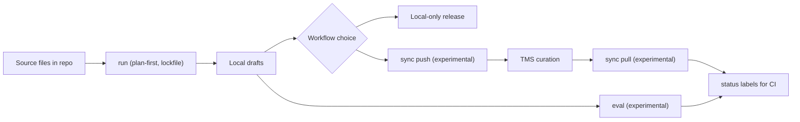

`hyperlocalise` giúp bạn tạo bản nháp bản dịch cho từng ngôn ngữ, tùy chọn đồng bộ với TMS của bạn và theo dõi những nội dung vẫn cần được rà soát.

## Trọng tâm nền tảng

- Lớp nhà cung cấp LLM: OpenAI, Azure OpenAI, Gemini, Anthropic, AWS Bedrock, LM Studio, Groq, Ollama
- Bộ điều hợp TMS (locale): Crowdin, LILT AI, Lokalise, Phrase, POEditor, Smartling
- Khung đánh giá (tùy chọn): chất lượng + kiểm tra hồi quy trên các ngôn ngữ/khu vực và mô hình
- CI-nhãn trạng thái sẵn sàng (thử nghiệm): `ready` / `needs review` / `missing`
- Kế hoạch-đầu tiên + lockfile: chạy có tính xác định và khác biệt có thể xem xét

## Biểu đồ tính năng

## Bắt đầu trong 10 phút

Sử dụng CLI này nếu bạn:

- Giữ các tệp bản dịch trong kho lưu trữ của bạn,
- muốn AI-bản nháp được tạo làm điểm khởi đầu,
- muốn chọn giữa số không-quy trình làm việc của con người và tuyển chọn nội dung thủ công tùy chọn trong TMS của bạn.

## Các bước tiếp theo phổ biến

| Giai đoạn | Thao tác | Tại sao điều này quan trọng |
| --- | --- | --- |
| 1 | [`init`](/commands/init) | Giàn giáo `i18n.jsonc` và các giá trị mặc định của bootstrap. |
| 2 | Cấu hình [`i18n config`](/configuration/i18n-config) | 3 |
| Xác thực kế hoạch và phát hiện vấn đề trước khi viết bản nháp. | [`run --dry-run`](/commands/run) | 4 |
| Tạo bản dịch nháp cục bộ. | [`run`](/commands/run) | 5 |
| Tải lên các thay đổi cục bộ lên TMS của bạn để phục vụ quy trình tuyển chọn. | [Phát hành từ kho lưu trữ cục bộ](/commands/run) | Không trả về nội dung nào-Đường dẫn thủ công khi quy trình của bạn cho phép xuất bản trực tiếp từ các đầu ra được tạo. |
| Xác định ngôn ngữ (thử nghiệm) | [`sync push` (thử nghiệm)](/commands/sync-push) | Biên tập trong TMS |
| 6 (tùy chọn) | Rà soát và chỉnh sửa bởi con người trong nền tảng dịch thuật của bạn. | Đưa các bản dịch đã được tuyển chọn trở lại kho lưu trữ. |
| 7 (tùy chọn) | [`sync pull` (thử nghiệm)](/commands/sync-pull) | 9 |
| Đo lường mức độ hoàn thành và công việc chưa giải quyết trong bất kỳ luồng quy trình nào. | [`status`](/commands/status) | Tìm hiểu hành vi của lệnh trong |

## Dành cho ai

1. [Cài đặt](/getting-started/install).
2. [Chạy hướng dẫn bắt đầu nhanh](/getting-started/quickstart).
3. [Thiết lập cấu hình i18n của bạn](/configuration/i18n-config).

## Quy trình làm việc cốt lõi

- Cấu hình thông tin xác thực của nhà cung cấp trong [tổng quan lệnh](/commands/overview).
- Hiểu hành vi đồng bộ hóa trong [thông tin xác thực của nhà cung cấp](/configuration/provider-credentials).
- Tổng quan về lưu trữ [quy trình làm việc của con người và việc biên tập thủ công tùy chọn trong POEditor, Lokalise hoặc Crowdin.](/storage/overview).
- Xem xét mức độ hoàn thiện của tính năng trong [ma trận ổn định](/reference/stability-matrix).
