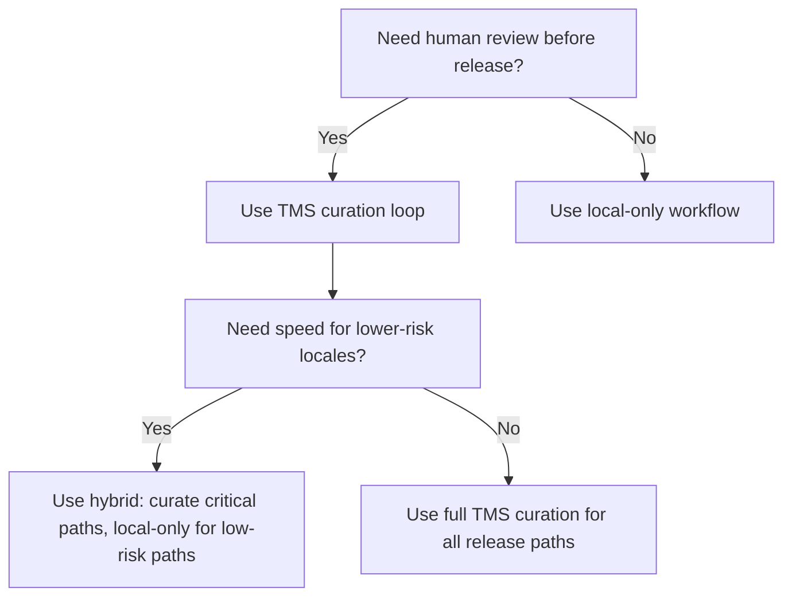

Use this guide to choose the workflow shape that matches your release risk, review requirements, and team capacity.

## Quick decision matrix

| Workflow | Best when | Tradeoff | Start here |
| --- | --- | --- | --- |
| Local-only | You need fastest iteration and can accept machine-first output risk | Lowest human review coverage | [Local generation workflow](/workflows/local-generation) |
| TMS curation loop | You require human review before release | Higher operational overhead and longer lead time | [TMS curation loop](/workflows/tms-curation-loop) |
| Hybrid | Some locales/features need curation, others can ship local-only | Requires clear policy per locale or bucket | [TMS curation loop](/workflows/tms-curation-loop) + [Local generation workflow](/workflows/local-generation) |

## Decision flow



## Recommended command sets

### Local-only baseline

```bash
hyperlocalise run --config i18n.jsonc --dry-run
hyperlocalise run --config i18n.jsonc
hyperlocalise status --config i18n.jsonc --output csv
```

### TMS curation baseline

```bash
hyperlocalise run --config i18n.jsonc
hyperlocalise sync push --config i18n.jsonc --dry-run=false --fail-on-conflict
hyperlocalise sync pull --config i18n.jsonc --dry-run=false --fail-on-conflict
hyperlocalise status --config i18n.jsonc --output csv
```

### Hybrid baseline

Use `--group`, `--bucket`, and `--locale` to route high-risk content through curation and lower-risk content through local-only release.

## Related docs

- [Why Hyperlocalise](/getting-started/why-hyperlocalise)
- [CI automation](/workflows/ci-automation)
- [Stability matrix](/reference/stability-matrix)
