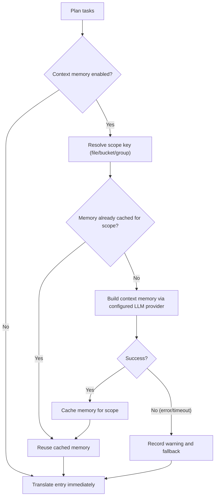

## 用法

```bash
hyperlocalise run [--config <path>] [--group <name>] [--bucket <name>] [--dry-run] [--workers <count>] [--output <report.json>] [--experimental-context-memory] [--context-memory-scope <file|bucket|group>] [--context-memory-max-chars <count>]
```

## 行为

1. 加载并验证配置，
2. 从组和存储桶规划任务，
3. 跳过已在其中的任务 `.hyperlocalise.lock.json`,
4. 执行剩余任务，
5. 将成功的任务持久化到锁定状态。

有关锁文件字段、生命周期和重置指南，请参见 [锁文件契约](/reference/lockfile-contract).

## 支持的本地文件格式

`run` 可读取具有以下扩展名的源文件和目标文件：

- `.json`
- `.arb`
- `.xlf` 和 `.xliff`
- `.po`
- `.md`
- `.mdx`
- `.strings`
- `.csv`

对于 JSON (`.json`), `run` 支持：

- 标准的嵌套键/值 JSON 对象
- 当根节点严格匹配时，对 FormatJS 消息 JSON 进行格式化：
  `{"[id]": {"defaultMessage": "[message]", "description": "[description]"}}`

在 FormatJS 模式下，仅 `defaultMessage` 已翻译。键 (消息 ID), `description`，以及其他非-消息元数据将被保留。

用于 Flutter ARB (`.arb`), `run` 仅翻译消息键，并保留元数据键，例如 `@key` 和 返回仅包含译文的文本，不要包含任何解释、标签、Markdown 或引号，除非译文内容本身需要它们。 `@@locale` 不变。

对于 Markdown 和 MDX (`.md`, `.mdx`), `run` 翻译提取的正文并保留非文本内容-可翻译结构：

- frontmatter 块 (`---`)
- 围栏代码块 (```` ``` ```` and `~~~`)
- 内联代码跨度
- Markdown 锚点，例如链接目标
- MDX `import` 和 `export` 行
- JSX/MDX 组件标签和属性值

适用于 Apple/Xcode 字符串 (`.strings`), `run` 保留模板中的注释和键/值格式，同时将值字面量替换为已翻译的文本。


对于 CSV (`.csv`), `run` 支持两种布局：

- 键/值布局 (例如： `key,value`)
- 每-区域设置列布局 (例如： `id,en,fr,de`)

在编写 CSV 目标时， `run` 保留现有的标头和非-目标列，在原位置更新匹配的键，并按确定性的排序顺序追加新键。

## 标志

- `--config`：配置文件路径 (default `i18n.jsonc` 在当前目录中)
- `--group`: 仅为给定的组名运行任务
- `--bucket`：仅运行指定存储桶名称的任务
- `--dry-run`：仅打印计划，不要翻译或写入文件
- `--force`: 重新运行所有计划的任务，并忽略锁文件跳过状态
- `--workers`：并行翻译工作线程数 (默认为 CPU 核心数)
- `--progress`：进度渲染模式 (`auto|on|off`，默认： `auto`)
- `--output`：写入机器-将可读的 JSON 运行报告写入指定路径
- `--experimental-context-memory`：启用两个-在翻译每个范围之前进行阶段上下文记忆生成
- `--context-memory-scope`: 上下文共享范围 (`file|bucket|group`，默认 `file`)
- `--context-memory-max-chars`：注入到每个翻译请求中的最大上下文记忆长度 (默认 `1200`)

### 进度调试日志记录 (可选)

为排查进度渲染问题，你可以在不更改 CLI 标志的情况下启用调试日志：

- `HYPERLOCALISE_PROGRESS_DEBUG=1` 启用进度调试日志记录。
- `HYPERLOCALISE_PROGRESS_DEBUG_FILE=<path>` 覆盖日志文件位置。

启用时的默认日志路径： `.hyperlocalise/logs/run.log`.

## 实验性上下文记忆流程

当 `--experimental-context-memory` 已启用， `run` 每个作用域只构建一次共享内存 (默认：每个源文件)然后在该作用域内对所有条目重复使用它。

如果记忆生成失败或超时， `run` 记录警告，并在该作用域内不使用共享内存继续翻译。



### 为什么它看起来像是在等待

- 在新作用域中首次进入时，会等待内存生成完成。
- 同一作用域中的后续条目会复用缓存的内存，并在无需重建的情况下继续执行。
- 进度 UI 现在显示上下文-在文件列表中记住步骤，以便你可以看到活动作用域-级别工作。


## 作用域适用于一个组

使用 `--group` 当你只想运行一个已配置的组时。

```bash
hyperlocalise run --config i18n.jsonc --group tests --dry-run
```

如果该组在您的配置中不存在， `run` 失败并返回一个 `unknown group` 规划错误。

## 作用域适用于一个存储桶

使用 `--bucket` 当你只想运行一个已配置的桶时。这对于聚焦更新、CI 分区，或在完整运行前验证单个区域很有用。

```bash
hyperlocalise run --config i18n.jsonc --bucket ui --dry-run
```

如果你的配置中不存在该存储桶， `run` 会因一个而失败 `unknown bucket` 规划错误。

## 强制重新运行所有计划任务

使用 `--force` 忽略锁定文件中的跳过状态，并再次执行每个已计划的任务。

```bash
hyperlocalise run --config i18n.jsonc --group tests --force
```

## 输出字段

- `planned_total`
- `skipped_by_lock`
- `executable_total`
- `succeeded`
- `failed`
- `persisted_to_lock`
- `prompt_tokens`
- `completion_tokens`
- `total_tokens`

每-区域设置令牌用法输出为： `locale_usage locale=<locale> prompt_tokens=<...> completion_tokens=<...> total_tokens=<...>`.

当你传递时 `--output`，JSON 报告包含运行元数据 (`generatedAt`, `configPath`)，汇总令牌用量，每-区域设置用法，并按-条目批量使用。

## 失败输出

任务失败时，输出包括 `failure target=<...> key=<...> reason=<...>`.


## 工作线程调优指南

较低 `--workers` 当你遇到提供商速率限制或在受限的 CI 环境中运行时。以此开始： `1` 先稳定重试次数，然后再逐步增加。

提升 `--workers` 在你的服务提供商配额和机器资源允许更高吞吐量时。以小步幅逐步增加，并监控 API 错误率以及本地 CPU 和内存使用情况。

## 另请参阅

- [eval](/commands/eval)
- [状态](/commands/status)
- [同步推送](/commands/sync-push)
- [同步拉取](/commands/sync-pull)
- [锁文件契约](/reference/lockfile-contract)
