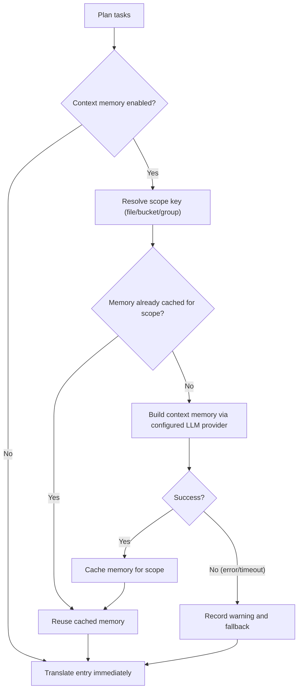

## 使用说明

```bash
hyperlocalise run [--config <path>] [--group <name>] [--bucket <name>] [--target-locale <locale>] [--dry-run] [--workers <count>] [--output <report.json>] [--experimental-context-memory] [--context-memory-scope <file|bucket|group>] [--context-memory-max-chars <count>]
```

## 行为

1. 加载和验证配置
2. 计划来自组和分区的任务
3. skip tasks already in `.hyperlocalise.lock.json`,
4. 执行剩余任务
5. 将成功的任务保存在锁定状态中。

关于锁文件字段、生命周期和重置的指导，请参阅 [锁文件合同](/reference/lockfile-contract)。

## 支持的本地文件格式

`run` can read source and target files with these extensions:

- `.json`
- `.arb`
- `.xlf` 和 `.xliff`
- `.po`
- `.md`
- `.mdx`
- `.strings`
- `.csv`

对于 JSON (`.json`)， `run` 支持：

- 标准嵌套的键/值 JSON 对象
- 当根路径严格匹配时，FormatJS消息JSON：
  `{"[id]": {"defaultMessage": "[message]", "description": "[description]"}}`

In FormatJS mode, only `defaultMessage` is translated. Keys (message IDs), `description`, and other non-message metadata are preserved.

对于 Flutter ARB (`.arb`)，`run` 仅翻译消息键，保留 `@key` 等元数据键，并在写入时将 `@@locale` 规范化为目标语言环境。

For Markdown and MDX (`.md`, `.mdx`), `run` translates extracted prose and preserves non-translatable structure:

- frontmatter 块 (`---`)
- 代码块 (```` ``` ```` 和 `~~~`)
- 内联代码块
- Markdown 锚点，例如链接目标
- MDX `import` and `export` lines
- JSX/MDX 组件标签和属性值

For Apple/Xcode Strings (`.strings`), `run` preserves comments and key/value formatting from the template while replacing value literals with translated text.


对于 CSV (`.csv`)， `run` 支持两种布局：

- 键/值布局（例如：`key,value`）
- 按区域列布局 (例如：`id,en,fr,de`)

When writing CSV targets, `run` preserves the existing header and non-target columns, updates matching keys in place, and appends new keys in deterministic sorted order.

## 标志

- `--config`: path to config file (default `i18n.jsonc` in current directory)
- `--group`: 仅运行指定组的任务
- `--bucket`: 仅运行指定的bucket名称的任务
- `--target-locale`: run only tasks for the given target locale (repeatable)
- `--dry-run`: print plan only, do not translate or write files
- `--force`: 重新运行所有计划的任务，并忽略锁文件跳过状态
- `--prune`: remove target keys that no longer exist in source files
- `--prune-max-deletions`: 在需要显式覆盖之前，每次运行中删除的最大旧密钥（默认 `100`）
- `--prune-force`: bypass the prune deletion safety limit
- `--workers`: number of parallel translation workers (defaults to CPU cores)
- `--progress`: progress rendering mode (`auto|on|off`, default: `auto`)
- `--output`: 将机器可读的 JSON 运行报告写入指定的路径
- `--experimental-context-memory`: enable two-stage context memory generation before translating each scope
- `--context-memory-scope`: context sharing scope (`file|bucket|group`, default `file`)
- `--context-memory-max-chars`: maximum context memory length injected into each translation request (default `1200`)

## 目标合同 `run`

- `system_prompt` is used for instructions and runtime context.
- `user_prompt` is used for payload content (text to translate, or source content to summarize for context memory).
- Translation flow supports profile `user_prompt` override.
- Context-memory 总结流程始终使用内置的总结负载模板，并且不应用 profile `user_prompt` 覆盖。

<Note>
Changing prompt structure (e.g. moving context from the user message to the system message) does not automatically invalidate cached translations. To force re-translation after a prompt restructure, bump the `prompt_version` in your profile.
</Note>

### 调试日志（可选）

要进行进度渲染故障排除，您可以启用调试日志，而无需更改命令行标志：

- `HYPERLOCALISE_PROGRESS_DEBUG=1` 启用进度调试日志。
- `HYPERLOCALISE_PROGRESS_DEBUG_FILE=<path>` 覆盖日志文件位置。

启用时的默认日志路径：`.hyperlocalise/logs/run.log`。

## 实验环境内存流程

当`--experimental-context-memory`启用时，`run`会在每个作用域中一次性创建共享内存（默认：每个源文件），然后将其用于该作用域中的所有条目。

如果内存生成失败或超时，`run`会记录一条警告并继续翻译，而不会使用该范围的共享内存。



### 它为什么会让人看起来在等待

- 在新的作用域中的第一个条目等待内存生成完成。
- 后续在同一作用域中的条目会重用缓存的内存，而无需重新构建。
- Progress UI 现在在文件列表中显示上下文-内存步骤，这样您就可以查看当前作用域的工作。


## 范围仅限于一个组

使用`--group`时，您想要仅运行一个配置的组。

```bash
hyperlocalise run --group tests --dry-run
```

If the group does not exist in your config, `run` fails with an `unknown group` planning error.

## 适用范围仅限于一个桶

Use `--bucket` when you want to run only one configured bucket. This is useful for focused updates, CI partitioning, or validating a single area before a full run.

```bash
hyperlocalise run --bucket ui --dry-run
```

If the bucket does not exist in your config, `run` fails with an `unknown bucket` planning error.

## 目标区域仅限于一个

Use `--target-locale` when you want to re-run only specific locales without changing group or bucket selection. You can repeat the flag to select multiple locales.

```bash
hyperlocalise run --group tests --target-locale fr --target-locale de --dry-run
```

If a requested locale is not present in `locales.targets`, `run` fails with an `unknown target locale` planning error. When combined with `--group`, only locales that belong to that group are planned.

当与`--prune`组合使用时，过时密钥检测也仅限于所选的目标区域。`run`仅扫描和清理属于过滤区域集的目标文件。

```bash
hyperlocalise run --prune --target-locale de --dry-run
```

## 强制重新运行所有计划的任务

使用`--force`来忽略跳过锁文件状态，并重新执行所有计划的任务。

```bash
hyperlocalise run --group tests --force
```

## 输出字段

- `planned_total`
- `skipped_by_lock`
- `executable_total`
- `succeeded`
- `failed`
- `persisted_to_lock`
- `prompt_tokens`
- `completion_tokens`
- `total_tokens`

每个区域的令牌使用情况以以下格式打印：`locale_usage locale=<locale> prompt_tokens=<...> completion_tokens=<...> total_tokens=<...>`

When you pass `--output`, the JSON report includes run metadata (`generatedAt`, `configPath`), aggregate token usage, per-locale usage, and per-entry batch usage.

## 错误输出

在任务失败时，输出包括`failure target=<...> key=<...> reason=<...>`。


## 工人调优指南

Lower `--workers` when you hit provider rate limits or run in constrained CI environments. Start with `1` to stabilize retries and then increase gradually.

Raise `--workers` when your provider quota and machine resources allow more throughput. Increase in small steps and watch API error rates plus local CPU and memory usage.

## 参见

- [eval](/commands/eval)
- [状态](/commands/status)
- [同步推送](/commands/sync-push)
- [同步拉取](/commands/sync-pull)
- [锁文件合约](/reference/lockfile-contract)
