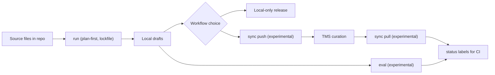

`hyperlocalise` 帮助你生成本地翻译草稿，可选择与 TMS 同步，并跟踪仍需审校的内容。

## 平台聚焦

- LLM 提供商层：OpenAI、Azure OpenAI、Gemini、Anthropic、AWS Bedrock、LM Studio、Groq、Ollama
- TMS 适配器 (可选): Crowdin、LILT AI、Lokalise、Phrase、POEditor、Smartling
- 评估框架 (实验性): 质量 + 跨地区/模型的回归检查
- CI-就绪状态标签 (实验性): `ready` / `needs review` / `missing`
- 计划-首先 + 锁文件：确定性运行和可审查的差异对比

## 特征图

## 10 分钟后开始

如果您符合以下情况，请使用此 CLI：

- 将翻译文件保留在你的代码库中，
- 想要 AI-将生成的草稿作为起点，
- 想在零之间进行选择-在您的 TMS 中实现人工工作流程和可选的人工审核。

## 常见的后续步骤

| 阶段 | 操作 | 为什么这很重要 |
| --- | --- | --- |
| 1 | [`init`](/commands/init) | 脚手架 `i18n.jsonc` 以及 Bootstrap 默认值。 |
| 2 | 配置 [`i18n config`](/configuration/i18n-config) | 定义区域设置、存储桶以及 LLM/存储设置。 |
| 3 | [`run --dry-run`](/commands/run) | 在撰写草稿之前验证计划并检测问题。 |
| 4 | [`run`](/commands/run) | 生成本地草稿翻译。 |
| 5 | [从本地仓库发布](/commands/run) | 零-当你的流程允许从生成的输出直接发布时的人为路径。 |
| 6 (可选) | [`sync push` (实验性)](/commands/sync-push) | 将本地更改上传到您的 TMS，用于策展工作流。 |
| 7 (可选) | 在 TMS 中策划 | 在您的翻译平台中进行人工审核和更正。 |
| 8 (实验性) | [`sync pull` (实验性)](/commands/sync-pull) | 将整理好的翻译内容同步回代码仓库。 |
| 9 | [`status`](/commands/status) | 在任一工作流路径中衡量完成情况和未解决的工作。 |

## 适用对象

1. [安装](/getting-started/install).
2. [运行快速入门](/getting-started/quickstart).
3. [设置你的 i18n 配置](/configuration/i18n-config).

## 核心工作流程

- 了解命令行为在 [命令概览](/commands/overview).
- 在中配置提供商凭据 [提供商凭据](/configuration/provider-credentials).
- 了解同步行为在 [存储概览](/storage/overview).
- 审查该功能的成熟度在 [稳定性矩阵](/reference/stability-matrix).
